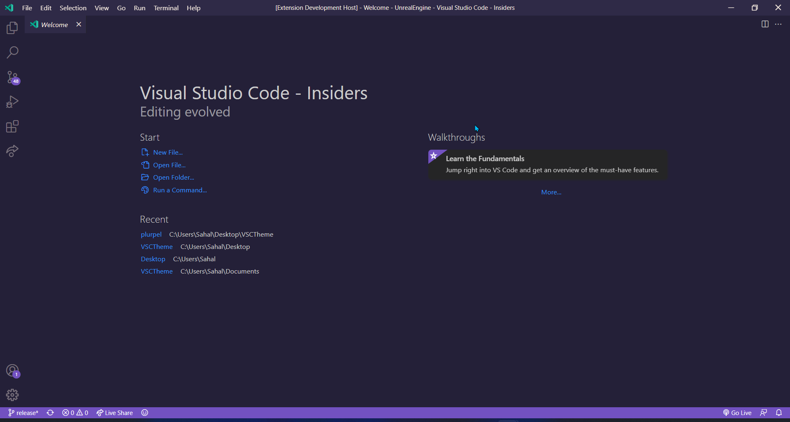
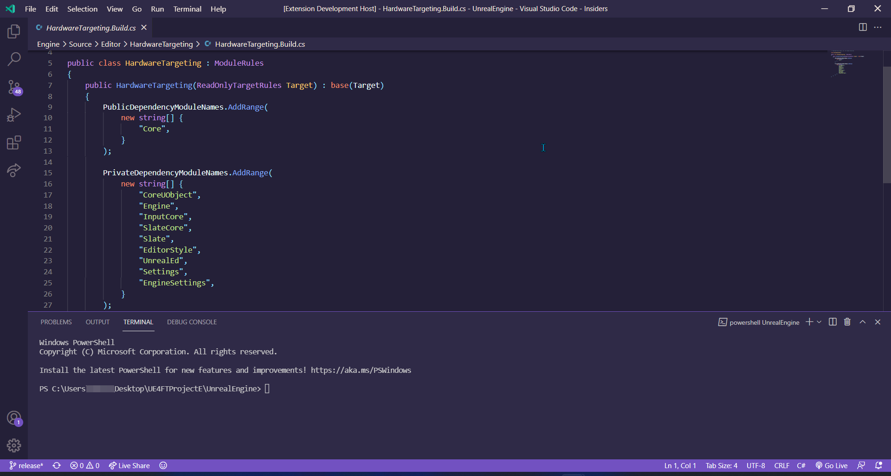
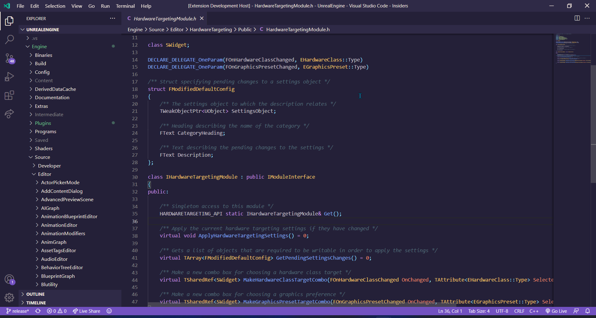

## Plurpel, A Purple And Creamy Theme For Visual Studio Code

___

## Special Thanks To

[Johan](https://github.com/JohanSanSebastian) For His Help With Color Palette Choosing And Helping With The Project :)

## Installation

1. Go to `Extensions`
2. Search for `Plurpel` and install it.
3. Go to `Color Themes` and choose `Plurpel` as the color them.

## Contributions, Issues And Pull Requests

- Your Contributions Are Welcome :)
- If You Want To Make A Change,
  1. Fork The Repo.
  2. Make Your Changes.
  3. Submit The PR.
  4. Wait And You'll See What Happens Next ;)

## Screenshots

 Welcome Page

 C++ Preview With Terminal

 C++ Preview

 Color Palette Used For The Theme Generated By [coolers](coolors.co/)